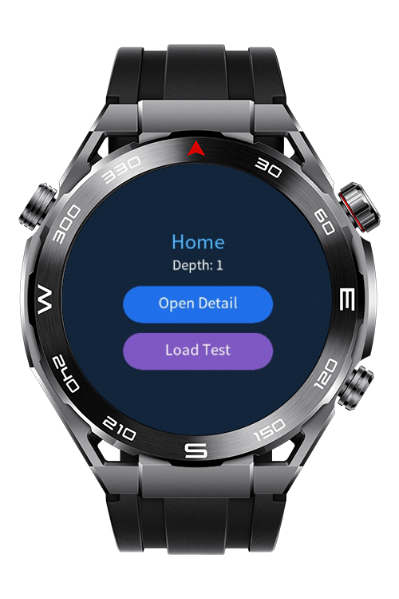
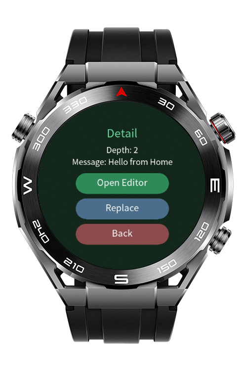
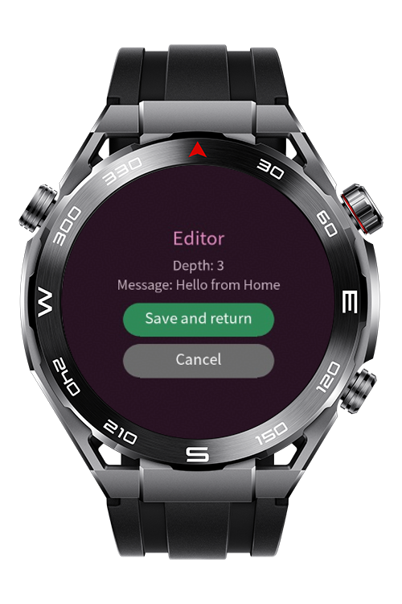
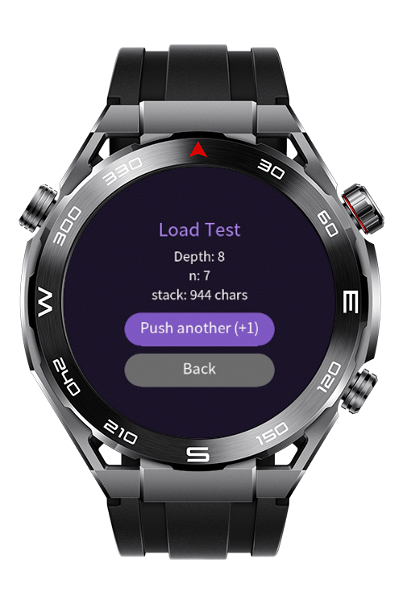
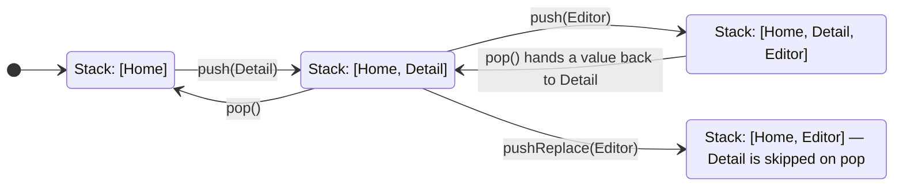

> **Note:** To access all shared projects, get information about environment setup, and view other guides, please visit [Explore-In-HMOS-Wearable Index](https://github.com/Explore-In-HMOS-Wearable/hmos-index).

# How To Implement a Custom Navigator

A tiny stack-based router for HarmonyOS / OpenHarmony **lite wearable** apps,
where `router.push` / `router.back` don't work.

```js
customRouter.push(uri, params)         // forward
customRouter.pop(result)               // back (optionally return a value)
customRouter.pushReplace(uri, params)  // replace the current page
```

# Preview

<div>
  
  
  
  
</div>

# Use Cases
- Easier and cleaner page navigation for lite wearables

# Technology
## Stack

- Languages: CSS, HML, JS
- Frameworks: 5.1.1(19)
- Tools: DevEco Studio Version 6.0.1.251
- Libraries:
  - @system.router
  - @system.file

## Setup

1. Copy `common/customRouter.js` and `common/fileUtils.js`into your project.
2. List every page in `config.json` → `module.js[0].pages`.
3. Wrap each page export with `customRouter.page(...)`.

## Usage

```js
import customRouter from '../../common/customRouter.js';

// --- Sender ---
customRouter.push('pages/detail/detail', { name: 'Ada', age: 36 });

// --- Receiver: pages/detail/detail.js ---
export default customRouter.page({
    data: { name: '', age: 0 },
    onInit(params, result) {
        this.name = params.name;                 // 'Ada' — no JSON.parse
        if (result) { /* a value a popped page returned */ }
    },
    save() { customRouter.pop({ ok: true }); },   // back, returning a value
    swap() { customRouter.pushReplace('pages/detail/detail', { name: 'Bob' }); }
});
```

- Params arrive as the **first** `onInit` argument.
- A value from `pop(value)` arrives as the **second** argument.
- `pushReplace` swaps the current page (a later `pop` skips it).

## Visual Flow



## Old vs. new

```js
// OLD — @system.router
router.replace({ uri: 'pages/detail/detail', params: { item: JSON.stringify(item) } });
//   receive:  onInit() { const item = JSON.parse(this.item); }
//   back:     not possible — replace again and rebuild everything

// NEW — customRouter
customRouter.push('pages/detail/detail', { item });   // real object
//   receive:  onInit(params) { const item = params.item; }
customRouter.pop();                                   // real back
```

| | Old `router.replace` | `customRouter` |
|---|---|---|
| Forward | `router.replace({ uri, params })` | `push(uri, params)` |
| Back | not possible | `pop()` |
| Replace | `router.replace({ uri, params })` | `pushReplace(uri, params)` |
| Object params | stringify / parse by hand | plain objects |
| Read params | `this.field` | `onInit(params)` |
| Return a value | not possible | `pop(value)` → `onInit(_, value)` |

## API

| Call | Does |
|---|---|
| `page(config)` | Wrap a page export; passes `(params, result)` to `onInit`. |
| `push(uri, params)` | Push a page. |
| `pushReplace(uri, params)` | Replace the current page. |
| `pop(result)` | Go back, with an optional return value. |
| `length()` / `canPop()` | Stack size / is there a page to go back to. |
| `reset(uri, params)` | Clear history and start fresh. |
| `getParams()` / `getResult()` | Manual reads (usually use the `onInit` args). |

## Rules

- Register every page in `config.json`.
- Wrap every page with `customRouter.page(...)`.
- Params must be JSON-serializable (no functions) — the stack is serialized to
  survive each hop.

> If your application has a large navigation tree with many parameters on the pages, set USE_FILE_STACK to 'true'. This will make the customRouter keep navigation stack on a file instead of passing the whole stack as a parameter to each page, reducing performance-related issues massively.

# Directory Structure
```
entry/src/main/
├── config.json
├── js/
│   └── MainAbility/
│       ├── app.js
│       ├── common/
│       │   └── customRouter.js  # Custom Router implementation using a stack
│       │   └── fileUtils.js     # File Utilities for file operations
│       ├── i18n/
│       │   ├── en-US.json
│       │   └── zh-CN.json
│       └── pages/               # Demo pages to test the customRouter
│           ├── detail/
│           │   ├── detail.css
│           │   ├── detail.hml
│           │   └── detail.js
│           ├── editor/
│           │   ├── editor.css
│           │   ├── editor.hml
│           │   └── editor.js
│           └── index/
│               ├── index.css
│               ├── index.hml
│               └── index.js
│           └── loadtest/       # Load testing page to test for performance on real devices
│               ├── loadtest.css
│               ├── loadtest.hml
│               └── loadtest.js
```

# Constraints and Restrictions
## Supported Devices
- Huawei Sport (Lite) Watch GT 4/5/6
- Huawei Sport (Lite) GT4/5 Pro
- Huawei Sport (Lite) Fit 3/4
- Huawei Sport (Lite) D2
- Huawei Sport (Lite) Ultimate

# LICENSE
**How To Implement a Custom Navigator** is distributed under the terms of the **MIT License**.
See the [LICENSE](/LICENSE) for more information.
